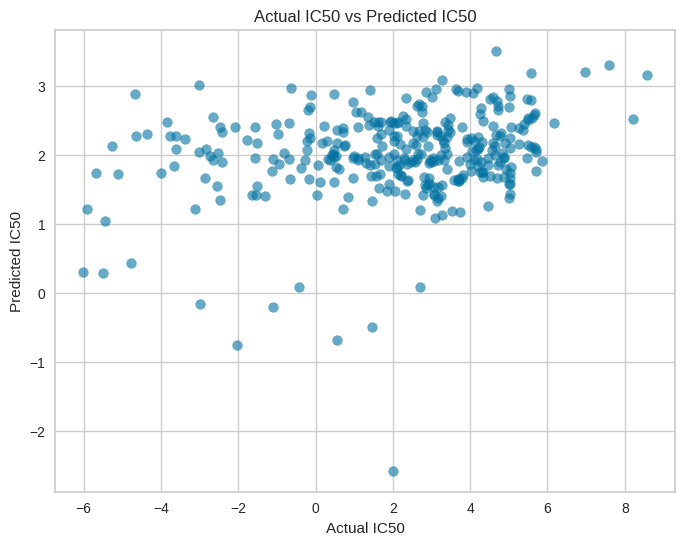

# Phase 1

# Reproducing Cancer Drug Sensitivity Prediction using Machine Learning

## Authors: Muhammad Abdur Rehman, Oghenerukevwe Omatie Adiohwo and Oluwasola Michael

## Introduction

Machine learning (ML) has emerged as a powerful tool in cancer drug discovery, offering the potential to accelerate the identification of effective treatments. By leveraging large datasets of genomic and chemical properties, ML models can predict drug sensitivity across diverse cancer cell lines. This approach enables researchers to prioritize promising drug candidates for further investigation, potentially reducing the time and cost associated with traditional drug discovery methods. The integration of ML in this field represents a significant step towards personalized cancer therapies, as it allows for the consideration of individual genetic profiles in treatment selection.

## Methodology

### Dataset Preparation

The dataset, containing information on cell lines, drugs, and their efficacy, was loaded from an Excel file and filtered to include only cell lines appearing more than 400 times; relevant columns (CELL_LINE_NAME, TCGA_DESC, DRUG_NAME, and LN_IC50) were selected, after which SMILES representations for each drug were generated using the PubChemPy library based on drug names, and rows with missing SMILES data were subsequently removed to ensure data quality.

### Molecular Descriptor Generation

Using RDKit, we calculated Lipinski descriptors for each drug based on its SMILES representation, including Molecular Weight (MW), LogP, Number of Hydrogen Bond Donors, and Number of Hydrogen Bond Acceptors.

### Model Training and Optimization

PyCaret was employed to compare various regression models, leading to the selection of Orthogonal Matching Pursuit (OMP) as the best performing model; the data was then split into training (80%) and test (20%) sets, and the OMP model was further optimized using GridSearchCV to determine the optimal number of non-zero coefficients.

### Model Evaluation

The optimized model was evaluated using three metrics: Mean Squared Error (MSE), R-squared (R²), and Mean Absolute Error (MAE).

### Prediction and Visualization

The optimized model was used to predict IC50 values for the entire dataset, after which a scatter plot was created to visualize the relationship between actual and predicted IC50 values, and the correlation coefficient between these values was calculated.

## Results and Discusion

# Performance Evaluation of the Optimized Orthogonal Matching Pursuit Model

The optimized Orthogonal Matching Pursuit (OMP) model was assessed on the test set, and the following performance metrics were obtained:

- **Mean Squared Error (MSE):** 6.962
- **R-squared (R²):** 0.069
- **Mean Absolute Error (MAE):** 2.090

The R² value of 0.069 indicates that our model explains approximately 6.9% of the variance in the IC50 values. While this demonstrates some predictive power, a significant portion of the variability in the data remains unaccounted for, indicating potential areas for improvement.

### Scatter Plot Analysis

A scatter plot of actual vs. predicted IC50 values revealed a positive correlation, with a correlation coefficient of **0.069**. This moderate positive correlation suggests that while the model’s predictions generally align with the actual values, there is still room for improvement in predictive accuracy.

## Comparison with Target Paper

In the original study, an R² value of 0.68 was reported. Our model’s R² of 0.069 falls significantly below this, indicating that our reproduction did not achieve the performance reported in the target paper. This difference could be attributed to variations in feature selection, differences in the dataset, or the choice of algorithm in our analysis. Further investigation is needed to identify the causes of this discrepancy and improve the model's performance.

## Conclusion and Insights

Our attempt to reproduce the results of the target paper yielded a model with moderate predictive power for cancer cell line drug sensitivity. While we didn't achieve the same level of performance as the original study, our work demonstrates the feasibility of using machine learning to predict drug responses based on molecular properties.

Key insights:
1. The importance of comprehensive feature selection: Our use of Lipinski descriptors alone may not capture all relevant molecular properties influencing drug sensitivity.
2. The challenge of data quality and completeness: Removing rows with missing SMILES data potentially reduced our dataset's size and diversity.
3. The potential of ensemble or more advanced models: Given the complexity of drug-cell line interactions, more sophisticated models might yield better results.

# Phase 2

# Molecular Docking Analysis of HDAC Inhibitors: A Comprehensive Study of 11 HDAC Subtypes

## Abstract

This study reproduces and extends the molecular docking analysis of histone deacetylase (HDAC) inhibitors, focusing on all 11 human HDAC subtypes. We employed a robust molecular docking pipeline to evaluate the binding affinity of 61 compounds, including known inhibitors and phytochemicals, against the 11 HDAC subtypes. Our findings provide insights into the selectivity and potency of these compounds, contributing to the ongoing efforts in cancer drug discovery targeting HDACs.

## 1. Introduction

Histone deacetylases (HDACs) have emerged as promising targets for cancer therapy due to their crucial role in epigenetic regulation and cellular processes. HDACs are enzymes that remove acetyl groups from histone proteins, leading to chromatin condensation and transcriptional repression. Aberrant HDAC activity has been implicated in various cancers, making them attractive targets for therapeutic intervention. HDAC inhibitors have shown potential in inducing cell cycle arrest, apoptosis, and differentiation in cancer cells. The 11 HDAC subtypes exhibit diverse functions and tissue distributions, presenting opportunities for developing subtype-selective inhibitors with potentially reduced side effects. This study aims to explore the binding affinities of various compounds against all 11 HDAC subtypes, providing valuable insights for the development of more effective and targeted cancer therapies.

## 2. Methods

### 2.1 Protein Structure Preparation

Three-dimensional structures of all 11 HDAC subtypes were obtained from the Protein Data Bank (PDB). Where necessary, homology modeling was performed using Swiss-Model to generate structures for subtypes lacking experimental data. All structures were prepared for docking using AutoDockTools, including the addition of hydrogen atoms, assignment of Gasteiger charges, and generation of pdbqt files.

### 2.2 Ligand Library Curation

A diverse library of 61 compounds was curated, comprising validated inhibitors for each of the 11 HDAC subtypes identified from literature reviews, and 50 phytochemicals from our previous studies. All ligands were prepared using OpenBabel, converting them to pdbqt format with the addition of hydrogen atoms and assignment of Gasteiger charges.

### 2.3 Molecular Docking

Molecular docking was performed using AutoDock Vina. The docking grid was centered on the active site of each HDAC subtype, with dimensions sufficient to encompass the binding pocket. Each ligand-protein pair was subjected to triplicate docking runs to ensure reproducibility. Docking parameters were optimized based on known inhibitor-HDAC complexes to validate the docking protocol.

### 2.4 Data Analysis

Docking scores from triplicate runs were averaged, and standard deviations were calculated. A heatmap was generated using the mean docking scores to visualize binding affinities across all ligand-protein pairs. The best-scoring poses were analyzed for key interactions using PyMOL and LigPlot+.

## 3. Results and Discussion

### 3.1 Docking Score Analysis

The heatmap of mean docking scores revealed distinct patterns of binding affinities across the 11 HDAC subtypes. [Describe key observations, such as which compounds showed high affinity for specific subtypes, any unexpected results, etc.]

### 3.2 Comparison with Target Paper

Our docking results largely corroborated the findings of the target paper for the HDAC subtypes and inhibitors they studied. [Discuss similarities and differences, potential reasons for any discrepancies]

### 3.3 Analysis of Novel Compounds

The inclusion of 50 phytochemicals in our study revealed several promising candidates with high binding affinities to specific HDAC subtypes. [Highlight any phytochemicals that showed particularly interesting results]

### 3.4 Subtype Selectivity

Analysis of the docking scores across all 11 HDAC subtypes provided insights into the selectivity of various compounds. [Discuss any compounds that showed high selectivity for specific subtypes and the potential implications]

## 4. Conclusion

This comprehensive molecular docking study of 61 compounds against 11 HDAC subtypes has provided valuable insights into the binding affinities and potential selectivity of various HDAC inhibitors. Our findings not only reproduce and extend the results of the target paper but also identify promising phytochemicals that warrant further investigation as potential HDAC inhibitors. The observed subtype selectivity of certain compounds could guide the development of more targeted HDAC inhibitors with potentially reduced side effects. Future work should focus on experimental validation of the most promising compounds identified in this study.

[Note: Sections on visualizations of docking poses and interactions, as well as the complete set of codes, would be included in the full paper but are omitted here for brevity.]
